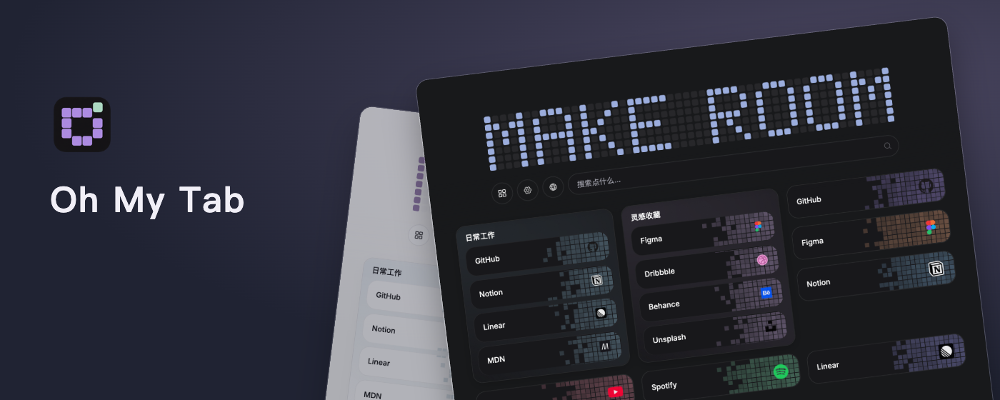

# Oh My Tab

[简体中文](README.md) · **English**

A customizable new tab page for your favorite sites, folders, and widgets.

[Download the latest release](https://github.com/trynewthin/oh-my-tab/releases/latest) · [Website](https://ohmytab.vercel.app/) · [Privacy policy](https://ohmytab.vercel.app/privacy)

## Make your new tab your own

Oh My Tab replaces the new tab page in Chrome or Edge. Arrange cards on a free grid, organize related sites into folders, and search bookmarks across your page and folders.

- **Organize your favorite sites:** add bookmarks and folders, drag to rearrange them, and choose card sizes. Multi-select items to organize them together.
- **Choose the grid columns:** set separate wide- and narrow-screen counts. The grid switches after the wide layout shrinks below 80%, then scales only if the narrow layout still does not fit. Defaults are four and two columns.
- **Search within reach:** find saved bookmarks or search the web with your chosen search engine. Add a movable search widget in 4×1, 8×1, or 12×1 sizes.
- **One-click shortcuts:** add 1×1 buttons to switch themes, tidy the grid, enter selection mode, or open settings and the component catalog.
- **Useful and playful widgets:** keep a calendar and to-do list nearby, draw on a dot canvas, or grow a pixel plant. Preview widgets and select their size before adding them.
- **Personalize the look:** choose light, dark, or system mode, set colors and backgrounds, and preview card styles and visual effects. The interface supports English and Simplified Chinese.
- **Bring your bookmarks:** optionally import Chrome or Edge bookmarks, with duplicate URLs and matching folder names handled for you.
- **Keep a backup:** export and restore complete ZIP backups, or manually transfer snapshots through your own HTTPS WebDAV server.

## Install

Install from the [Chrome Web Store](https://chromewebstore.google.com/detail/aihmkimlgdondkkeghfnkiknnocoiioa), or load a release manually:

1. Download the latest ZIP from [Releases](https://github.com/trynewthin/oh-my-tab/releases) and extract it.
2. Open `chrome://extensions/` in Chrome or `edge://extensions/` in Edge.
3. Enable **Developer mode** and select **Load unpacked**.
4. Choose the extracted directory containing `manifest.json`.

Open a new tab to get started. Pin the extension to your toolbar to quickly save the current page. Store updates may arrive later than GitHub releases while they are under review.

## Get started

1. Open **More actions** to add a bookmark, folder, or component.
2. Drag cards to arrange your page, or move related bookmarks into a folder.
3. Right-click a card to see its available editing, size, and deletion options.
4. Open **Settings** to change the theme, language, search engine, background, and effects.

## Data and privacy

Bookmarks, layouts, preferences, and background images are stored on your device by default. Oh My Tab contains no advertising or behavioral analytics.

Search suggestions, third-party site icons, browser bookmark import, and WebDAV require you to opt in or initiate the action. ZIP backups are not encrypted; store them securely. See the [privacy policy](https://ohmytab.vercel.app/privacy) for permission usage and network access details.

<details>
<summary>Development and contributions</summary>

Requires Node.js 22.12 or later.

```bash
npm ci
npm run dev
```

Before submitting changes:

```bash
npm run check
npm run build
npm test
npm run test:extension
```

The product website is a separate workspace:

```bash
npm run website:dev
npm run website:build
```

See the [project documentation](docs/README.md) for development, testing, and release details (primarily in Chinese).

</details>

## Acknowledgments

Built with React, shadcn/ui, and Tailwind CSS. Drag and drop uses dnd kit, animation uses GSAP, and icons come from Phosphor Icons.
