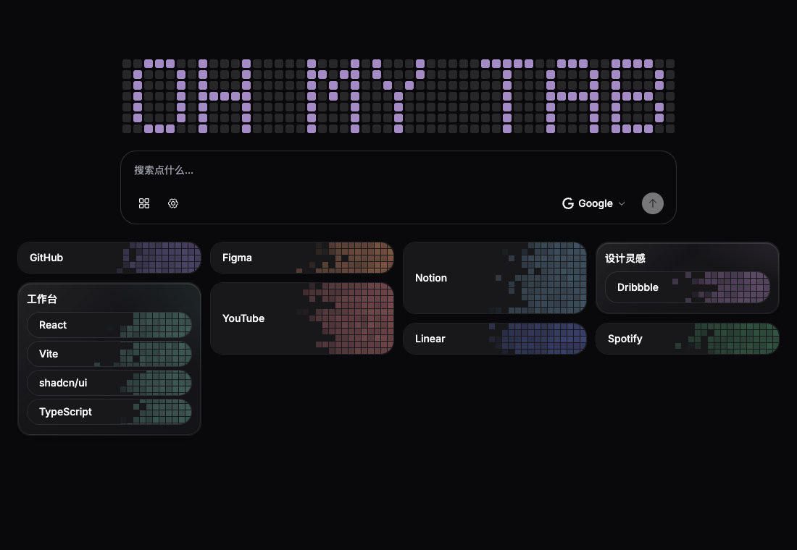
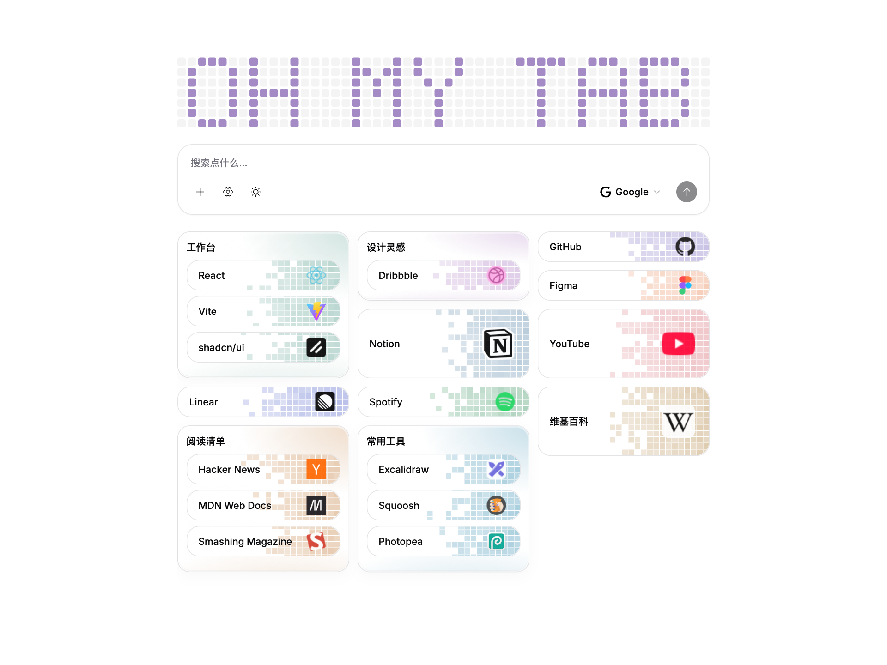
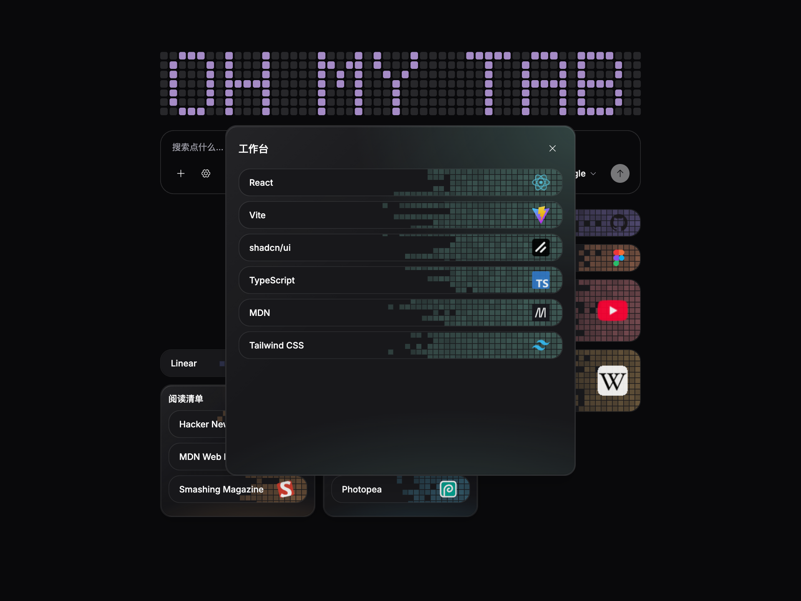
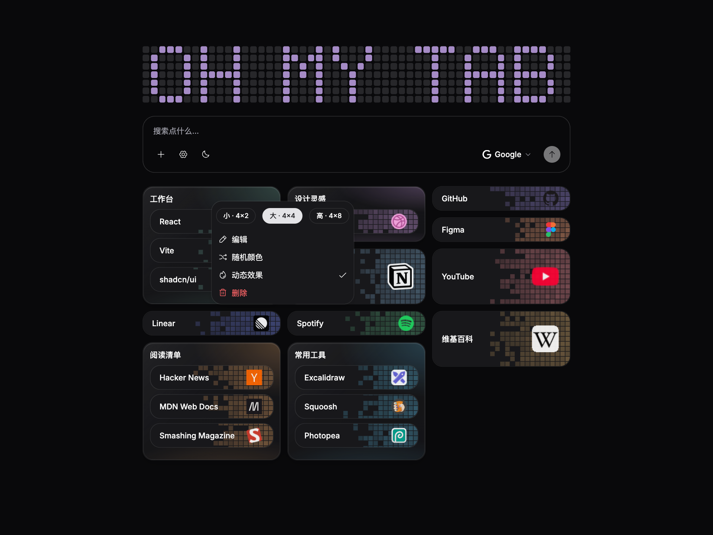
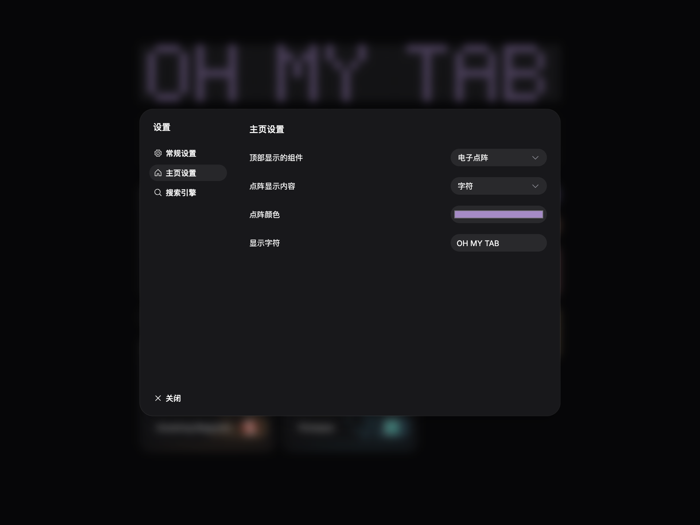
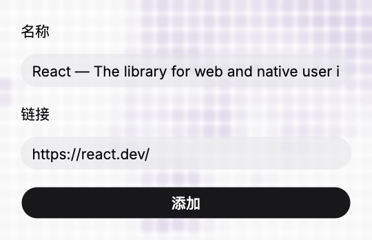

# Oh My Tab

一个可自定义的浏览器新标签页扩展。用电子点阵、像素背景和可拖拽的标签网格，整理你的常用网站。

基于 React、TypeScript、Vite、shadcn/ui、Zustand 和 GSAP 构建。



> 本文所有截图均使用独立测试环境中的 mock 数据，链接为公开示例网站。

## 特色

- **新手教程**：首次打开自动逐步介绍按钮和常用操作；完成或跳过后不再自动弹出，可在「设置 → 常规设置」重新开始。
- **电子点阵**：时间、英文字符、宠物、海洋呼吸四种模式，自定义点阵颜色，空闲格子跟随深浅主题。
- **自由网格**：拖动排列并保留空位。标签支持 4×1、4×2；文件夹支持 4×2、4×4、4×8。
- **文件夹交互**：标签拖入、拖出和内部排序；中心停留确认放入；滚动时渐隐与堆叠；点击放大展开。
- **像素背景**：随机颜色、动态燃烧，文件夹内使用统一色彩和接续效果。
- **右键操作**：尺寸徽章、编辑、随机颜色、动态效果、刷新图标与二次点击删除。
- **搜索建议**：匹配主页及文件夹中的收藏，并获取 Bing 实时关键词联想，支持方向键选择、Enter 打开、Esc 收起和 `/` 聚焦搜索框。
- **快捷搜索**：预设和自定义搜索引擎，新标签页打开搜索结果，提交后清空输入。
- **扩展弹窗**：读取当前网页标题与链接，一键添加；背景采用呼吸点阵和轻度模糊。
- **配置管理**：Gzip 压缩文本导入导出，导出直接复制，导入校验后确认覆盖。
- **本地图标缓存**：优先使用已打开网页实际图标，再解析网页声明、站点 favicon 和第三方来源；成功保存到 IndexedDB，右键可刷新。

## 预览

### 浅色主题



### 文件夹展开



### 右键管理



### 主页设置



### 快捷添加



## 本地安装

需要 Node.js 22.12+ 和 npm。

```bash
npm ci
npm run build
```

1. 在 Chrome 打开 `chrome://extensions/`。
2. 开启「开发者模式」，点击「加载未打包的扩展程序」。
3. 选择项目的 `dist` 目录。
4. 打开新标签页；将扩展固定到工具栏，便于快捷添加网站。

源码更新后，重新构建并在扩展管理页重新加载。安装包初始网格为空；开发环境提供 mock 数据。开发预览和扩展的配置相互独立，可以通过配置文本迁移。

## 开发和验证

```bash
npm run dev           # 开发预览
npm run build         # 类型检查与扩展构建
npm run lint
npm test              # 页面和设置交互测试
npm run test:unit     # 配置压缩与图标缓存测试
```

页面测试默认使用 macOS 上的 Google Chrome；其他环境可运行 `npx playwright install chromium`，或设置 `PLAYWRIGHT_CHROMIUM_EXECUTABLE_PATH`。

生成展示截图：

```bash
npm run build
npm run preview -- --host 127.0.0.1 --port 4173
# 在另一终端执行：
npm run screenshots
```

截图脚本使用全新浏览器上下文和内置 mock 数据，不读取日常浏览器配置。`SHOWCASE_URL` 可以指定预览地址。

## 数据与权限

- 在搜索框输入时，停顿 250 毫秒后会向 Bing 联想服务发送关键词（不携带 Cookie）；选择联想词后使用当前选中的搜索引擎搜索。服务不可用时仍可正常搜索。
- 标签、分组、布局及设置保存在本地浏览器；图标文件保存在 IndexedDB。
- `activeTab` 用于点击扩展图标时读取当前网页标题和链接。
- HTTP/HTTPS 网站权限用于获取网页和图标，并读取已打开的匹配网页图标。
- 未命中本地缓存时，会请求网站；必要时向 Favicon.im、DuckDuckGo 查询该网站域名。下载不携带凭据。
- 成功缓存不会定时过期，失败缓存 15 分钟。配置文本不包含图标缓存，也不加密，请妥善保管包含个人链接的导出文本。
- HTML 解析不执行网页脚本；未打开的网站若通过 JavaScript 更换图标，可能需要打开该网站后手动刷新图标。

## 项目结构

```text
src/pages/home/          主页背景和 UI
src/pages/popup/         扩展快捷添加弹窗
src/components/dot-matrix/  点阵字形与呼吸效果
src/components/tab-grid/   标签、文件夹、网格和拖拽
src/components/settings/   设置对话框
src/components/ui/         shadcn 基础组件
src/stores/             Zustand 状态与持久化
src/lib/                图标缓存、配置编解码等
public/manifest.json    Manifest V3 扩展清单
plugins/                开发预览的图标下载代理
```

## 致谢

界面采用 [shadcn/ui](https://ui.shadcn.com/)，输入框基于 [Prompt Kit](https://www.prompt-kit.com/)。图标使用 [Phosphor](https://phosphoricons.com/) 与 [Simple Icons](https://simpleicons.org/)，动画使用 [GSAP](https://gsap.com/)，拖拽基于 [dnd kit](https://dndkit.com/)。网站标识属于各自权利人。

## 发布与自动打包

在 [Releases](https://github.com/trynewthin/oh-my-tab/releases) 下载正式版本的 ZIP 或 CRX。

推送 `main`、推送 `v*` 标签或手动运行 **Build extension** 工作流，会生成 ZIP 和 CRX。PR 构建只生成 ZIP，不读取签名密钥。推送 `v*` 标签会在构建和校验通过后自动发布 GitHub Release，附带 ZIP 和 CRX。

在仓库 **Actions → Build extension → 对应运行 → Artifacts** 下载构建产物，保留 30 天。解压 artifact 后包含：

- `oh-my-tab-版本-提交.zip`：扩展安装目录，解压后可在 Chrome / Edge 加载；`manifest.json` 位于根目录。
- `oh-my-tab-版本-提交.crx`：使用固定私钥签名的 CRX3 包。浏览器对商店外 CRX 安装存在限制，开发调试优先使用 ZIP。

签名私钥由仓库 Secret `EXTENSION_SIGNING_KEY` 提供，值为完整 PEM 文本。自行 fork 时，需要生成 RSA 私钥并配置同名 Secret；请在仓库外保管密钥。保持同一私钥才能保持同一扩展 ID。本地按目录加载的扩展 ID 可能与签名 CRX 不同。
